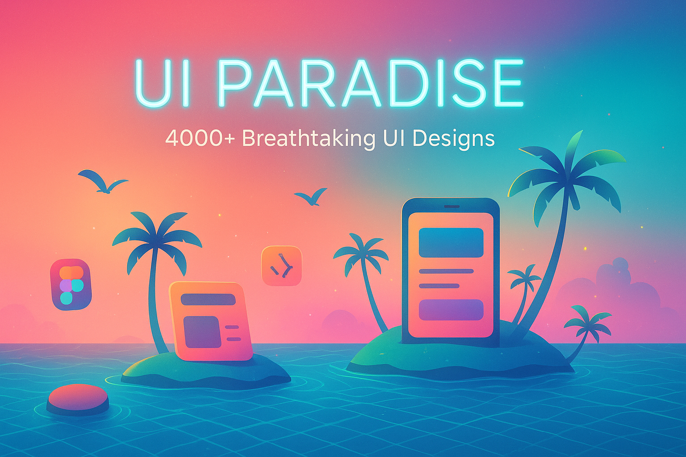

# 🏝️ UI Paradise
### *Your Gateway to 4000+ Breathtaking UI Designs*

<div align="center">




**🚀 Curated by [Kanugula Shivashanker](https://github.com/shivas1432)**

*Full-Stack Developer | React, Node.js Expert | UI/UX Enthusiast*

---

### ✨ **Welcome to Design Paradise**

</div>

## 🎯 What's Inside?

Welcome to **UI Paradise** - a tropical island of creativity where **4000+ stunning UI designs** await your discovery! This carefully curated collection is your one-stop destination for modern, beautiful, and functional interface designs.

## 🏖️ Paradise Categories

<table>
<tr>
<td>

### 🎛️ **Interactive Oasis**
- 🔘 **Buttons** - Clickable wonders
- 📋 **Cards** - Information sanctuaries  
- ☑️ **Checkboxes** - Selection paradises
- 📝 **Forms** - Data collection havens
- 📱 **Inputs** - User interaction ports

</td>
<td>

### 🌺 **Advanced Tropics**
- ⚡ **Loaders** - Loading animations
- 🔔 **Notifications** - Alert beaches
- 🎭 **Patterns** - Background lagoons
- 📻 **Radio Buttons** - Choice islands
- 🔄 **Toggle Switches** - State flippers

</td>
</tr>
</table>

### 🌴 **UI Elements & Beyond**
- 🛠️ **Tooltips** - Information coconuts
- 🎪 **UI Components** - Paradise miscellany

## 🚀 Quick Dive In

```bash
# Clone your slice of paradise
git clone https://github.com/shivas1432/UI-Paradise.git

# Enter the tropical design world
cd UI-Paradise

# Start your design adventure!
```

## 🏄‍♂️ How to Surf Paradise

1. **Explore Islands**: Navigate through organized design categories
2. **Collect Treasures**: Find UI gems that spark your creativity  
3. **Build Dreams**: Transform inspiration into stunning applications
4. **Share Paradise**: Contribute your own design masterpieces

## 🛠️ Perfect For

- **Frontend Developers** crafting React, Vue, Angular experiences
- **UI/UX Designers** hunting for creative inspiration
- **Product Teams** designing next-gen interfaces
- **Design Students** mastering modern web aesthetics

## 🤝 Join Paradise Community

Help us grow this tropical design haven!

```bash
# Fork this paradise
# Create your design branch
git checkout -b feature/tropical-ui-design

# Commit your creative work
git commit -m '🌺 Add stunning new UI design'

# Push to paradise
git push origin feature/tropical-ui-design

# Share with the community
```

## 📊 Paradise Stats

<div align="center">


</div>

## 🌟 Paradise Showcase

*"Design creates culture. Culture shapes values. Values determine the future."* - Robert L. Peters

This collection represents a journey through modern design excellence. Each component is a carefully crafted piece of digital art, designed to elevate user experiences to paradise-level quality.

## 🏝️ Connect in Paradise

<div align="center">

[](https://www.linkedin.com/in/shivashanker-kanugula-51a512262)
[](https://www.shivashanker.com)
[](https://t.me/helpme_coder)

**📧 Paradise Contact**: [ss_web_innovations](mailto:contact@shivashanker.com)

</div>

## 📄 Paradise License

This project is licensed under the MIT License - see the [LICENSE](LICENSE) file for details.

## 🙏 Paradise Gratitude

- Inspired by the global design community
- Endless thanks to all contributors
- Crafted with 🌺 for designers and developers worldwide

---

<div align="center">

### 🌟 **Star this paradise if it inspired you!** 🌟

**Created with 💖 by [Kanugula Shivashanker](https://github.com/shivas1432)**

*"Building digital paradises, one pixel at a time"*

</div>
